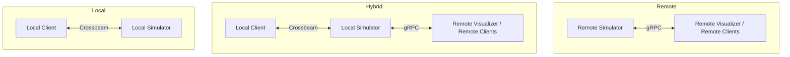

# 🧩 Simulator Framework

A modular simulation system supporting **local**, **hybrid**, and **remote** execution modes — designed for distributed simulation, experimentation, and visualization.

---

## 🚀 Overview

This simulator can run in multiple modes:

| Mode | Description | Communication |
|------|--------------|----------------|
| **Local** | Fastest single-process setup. Simulator and client run in the same process using in-memory (Crossbeam) channels. | Crossbeam channels |
| **Hybrid** | Local simulator with an exposed gRPC service endpoint, allowing external clients or visualizers to connect. | Crossbeam + gRPC |
| **Remote** | Standalone gRPC simulator service, typically running on another machine. Remote clients and visualizers connect to it. | gRPC only |

---

## ⚙️ Setup

Ensure you have:

- **Rust** ≥ 1.75 (`rustup install stable`)
- **Tokio runtime**
- **Protobuf / tonic** dependencies built (handled by `cargo build`)

Build everything:

```bash
cargo build --workspace
```

---

## 🧠 Modes and Usage

Below are all available configurations.

---

### 🧩 Option 1: Local Simulator

Runs the simulator and client logic in one process — fastest configuration for testing or benchmarking.

```bash
cargo run -p sim-app --bin app -- --mode local --n-states 1000
```

- Uses only in-process channels (no gRPC).
- Runs the simulation loop locally until the specified number of states are processed.

---

### 🔄 Option 2: Hybrid Simulator

Runs a local simulator **and** exposes a gRPC service endpoint so external tools (like a visualizer or remote clients) can connect.

```bash
cargo run -p sim-app --bin app -- --mode hybrid --addr 127.0.0.1:60000 --n-states 1000
```

- Local client interacts with the simulator directly.
- Other remote tools can connect at `127.0.0.1:60000`.

> 💡 Ideal for running local experiments while allowing external monitoring.

---

### 🌐 Option 3: Remote Simulator Service

Runs the simulator **as a standalone gRPC service**.  
External clients or visualizers connect remotely to this address.

```bash
cargo run -p sim-app --bin sim_service -- --addr 127.0.0.1:60000
```

- Does not run a local client — only the simulation backend.
- Can be deployed remotely (e.g., in Docker or on another host).

---

## 🖼️ Visualizer

Connects to any simulator (hybrid or remote) to view simulation states.

### Remote Visualizer (non-blocking)

Runs asynchronously and returns control after launch.

```bash
cargo run -p sim-remote-client -- --addr 127.0.0.1:60000 --n-states 1000 --app-id visualizer-1
```

### Remote Visualizer (blocking)

Waits for all states to be processed before exiting.

```bash
cargo run -p sim-remote-client -- --addr 127.0.0.1:60000 --n-states 1000 --app-id visualizer-1 --blocking
```

## 🧑‍💻 Clients

Clients participate in the simulation by voting on steps or sending control commands.  
Multiple clients can connect to the same simulator.

### Remote Client 1

```bash
cargo run -p sim-app --bin app -- --mode remote --addr 127.0.0.1:60000 --n-states 1000 --app-id client-1
```

### Remote Client 2

```bash
cargo run -p sim-app --bin app -- --mode remote --addr 127.0.0.1:60000 --n-states 1000 --app-id client-2
```

> 💡 Each client has a unique `--app-id` so the simulator can track participants independently.

---

## 🧭 Quick Reference

| Role | Binary | Example Command |
|------|---------|-----------------|
| Local Simulator | `sim-app (bin app)` | `--mode local` |
| Hybrid Simulator | `sim-app (bin app)` | `--mode hybrid --addr 127.0.0.1:60000` |
| Remote Simulator | `sim-app (bin sim_service)` | `--addr 127.0.0.1:60000` |
| Remote Client | `sim-app (bin app)` | `--mode remote --addr 127.0.0.1:60000` |
| Visualizer | `sim-remote-client` | `--addr 127.0.0.1:60000` |

---

## 🔌 Architecture Diagram (Mermaid)



## 📜 License

MIT License © 2025  
Developed for distributed simulation research and experimentation.
