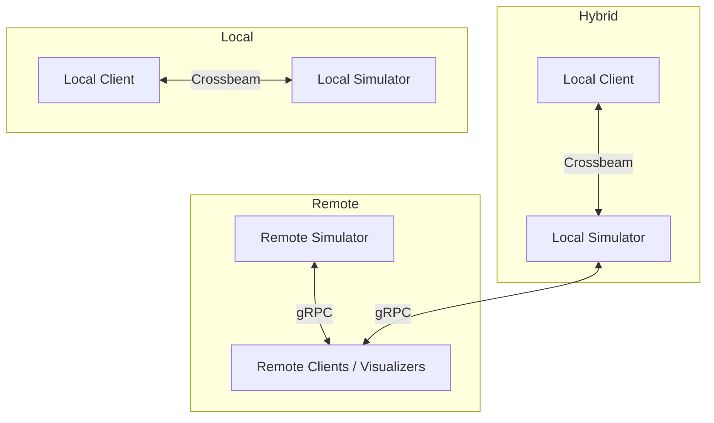

# 🧩 Simulation Server Workspace

A modular **distributed simulation framework** built in Rust — supporting **local**, **hybrid**, and **remote** modes for simulation, coordination, and visualization.

---

## 🚀 Overview

This workspace is organized into multiple crates, each handling a distinct part of the system:

| Crate                                  | Role                    | Description                                            |
| -------------------------------------- | ----------------------- | ------------------------------------------------------ |
| 🧱 [`bridge`](./crates/bridge)         | Core networking layer   | Local + gRPC communication, client/server abstractions |
| 🧩 [`controller`](./crates/controller) | Control interface       | Example binaries to launch servers and clients         |
| 🔌 [`interface`](./crates/interface)   | Protocol definitions    | Protobuf + tonic-generated message types               |
| 🧮 [`simulator`](./crates/simulator)   | Simulation core         | Simulation trait, ticking, and test implementations    |
| 🎨 [`visualizer`](./crates/visualizer) | Visualization utilities | Example visualization clients (blocking/non-blocking)  |

All crates live under the `crates/` directory and build together as a single Cargo workspace.

---

## ⚙️ Building

Requires:

* **Rust** ≥ 1.90 (`rustup update`)

To build everything:

```
cargo build
```

Run all tests:

```
cargo test
```

---

## 🧠 Architecture

The system supports three deployment modes:

| Mode       | Description                                                                           | Communication    |
| ---------- | ------------------------------------------------------------------------------------- | ---------------- |
| **Local**  | Single-process. The simulator and clients run together using fast in-memory channels. | Crossbeam        |
| **Hybrid** | Local simulator with exposed gRPC endpoint for external clients.                      | Crossbeam + gRPC |
| **Remote** | Full networked setup where the simulator runs remotely.                               | gRPC             |

---

## 🧰 Running Examples

### 🧩 Local Simulation

Everything runs in a single process — fastest mode for development.

```
cargo run -p controller --example local
```

### 🔄 Remote Server

Runs a server which exposes a gRPC endpoint for remote clients:

```
cargo run -p controller --example server
```

Then connect clients:

```
cargo run -p controller --example remote
```

Or visualizers:

```
cargo run -p visualizer --example remote_blocking
```

### 🌐 Remote Client and Server

Run the server and client together remotely:

```
cargo run -p controller --example remote_with_server
```

Connect using a remote visualizer:

```
cargo run -p visualizer --example remote_blocking
```

---

## 🖼️ Visualizer

The visualizer can be run with a local server or by connecting to a remote server. Nonblocking means the server will not wait for the visualizer to finish rendering frames (may skip some simulation steps).

Examples:

```
cargo run -p visualizer --example local_blocking
cargo run -p visualizer --example remote_blocking_with_server
cargo run -p visualizer --example remote_blocking
cargo run -p visualizer --example remote_nonblocking_with_server
cargo run -p visualizer --example remote_nonblocking
```

---

## 🔌 Architecture Diagram (Mermaid)



## 📜 License

MIT License © 2025
Developed as a template for distributed simulation.
